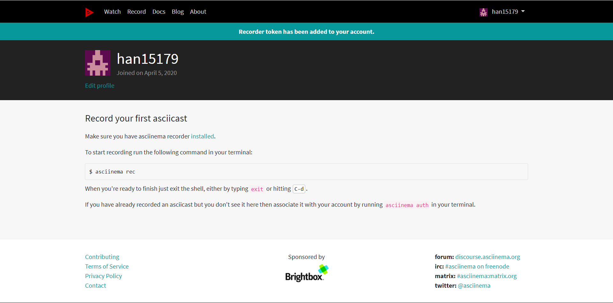
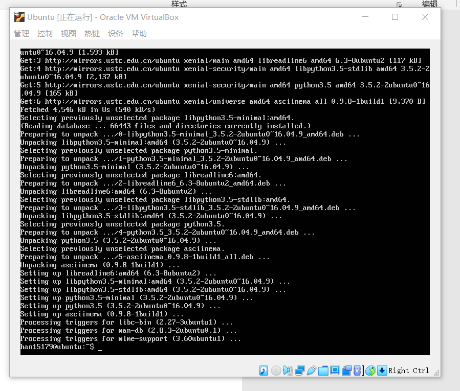
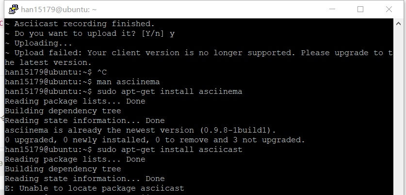
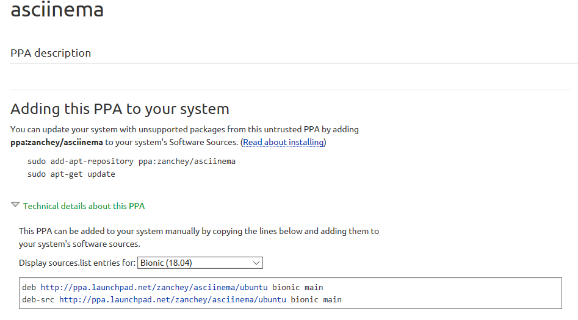

# 实验二

## 1.实验准备

- 虚拟机：VIrtualBox 6.1.4 r136177 (Qt5.6.2)
- Linux系统：ubuntu 18.04.4 server 64bit
  
## 2.实验过程

### step1：注册asciinema账号，在Linux端安装好asciinema，将本地和在线账号进行关联

- 在[asciinema](https://asciinema.org/)网页上注册
  

- 关联用户
  - 在Ubuntu上安装asciinema：
    ```shell
    sudo apt-add-repository ppa:zanchey/asciinema
    sudo apt-get update
    sudo apt-get install asciinema
    ```
    
  - 本地关联：
    ```shell
    asciinema auth
    ```
  
### step2：使用asciinema录制vimtutor的全程操作

#### Lesson 1 
  [](https://asciinema.org/a/5hpKLifXkXIAYBkE8BGqmdhWp)
#### Lesson 2
  [](https://asciinema.org/a/YQKWd1ukAecnsINdmTY9LH0PX)
#### Lesson 3
  [](https://asciinema.org/a/LKkUJoBaczSS65YR3R9aFsxv2)
#### Lesson 4
  [](https://asciinema.org/a/317037)
#### Lesson 5
  [](https://asciinema.org/a/jTdMKYvM8qqHtMeMHv1wWi1vi)
#### Lesson 6
  [](https://asciinema.org/a/GQZBAaeA26WQR43h3VgzazVHm)
#### Lesson 7
  [](https://asciinema.org/a/Pa9fd0fCEh0vAmI2SRfvOLvfJ)


### step3：vimtutor自查清单


- 你了解vim有哪几种工作模式？
  
  - Normal mode:普通模式，vim打开文件时的初始模式，可以使用h、j、k、l进行光标移动，也可以用x、d、p等对文件内容进行删改，其他模式可以通过「Esc」返回Normal模式
  
  - Visual mode:可视模式，在Normal模式下，使用v、V进入Visual模式，此时通过光标移动将选择内容高亮
  
  - Insert mode:插入模式，在Normal模式下，使用i、I、a、A、o、O、s、S、c、C都可以进入Insert模式，区别一般在于进入Insert模式后光标的插入位置不同，有的还会在进入Insert模式时执行特定的操作

- Normal模式下，从当前行开始，一次向下移动光标10行的操作方法？如何快速移动到文件开始行和结束行？如何快速跳转到文件中的第N行？
  - 一次向下移动光标10行：10j
  - 移动到文件开始行：gg
  - 移动到文件结束行：G
  - 快速跳转到文件中的第N行：NG / Ngg


- Normal模式下，如何删除单个字符、单个单词、从当前光标位置一直删除到行尾、单行、当前行开始向下数N行？
  
  - 删除单个字符：
    - 向右删除：x
    - 向左删除：dr
  
  - 删除单个单词：
    - dw：光标在单词第一个字母
    - de：光标在单词第一个字母及之前
    - daw/bdw：光标在单词最后一个字母及之前
  
  - 从当前光标位置一直删除到行尾：d$ / D
  - 删除单行：dd
  - 删除当前行开始向下数N行：Ndd

- 如何在vim中快速插入N个空行？如何在vim中快速输入80个-？
  - 快速插入N个空行：
    - 向下插入 ：No
    - 向上插入 ：NO
  - 快速输入80个-：80[ i / a ]-

- 如何撤销最近一次编辑操作？如何重做最近一次被撤销的操作？
  - 撤销最近一次编辑操作：u
  - 重做最近一次被撤销的操作：Ctrl+r

- vim中如何实现剪切粘贴单个字符？单个单词？单行？如何实现相似的复制粘贴操作呢？
  - 剪切粘贴：先删除它们,再按p即可。
  - 复制粘贴：
    - 单个字符：ylp(复制光标所在字符）/yhp（复制光标前一个字符）
    - 单个单词：ywp
    - 行：yyp
    - 内容块：[Visual模式下高亮选择内容块]yp

- 为了编辑一段文本你能想到哪几种操作方式（按键序列）？
  - w、e、0、$、nh、nj、nk、nl光标移动
  - x,r 删除替换
  - i/No 插入操作
  - :wq 保存退出


- 查看当前正在编辑的文件名的方法？查看当前光标所在行的行号的方法？
  - Ctrl+g


- 在文件中进行关键词搜索你会哪些方法？如何设置忽略大小写的情况下进行匹配搜索？如何将匹配的搜索结果进行高亮显示？如何对匹配到的关键词进行批量替换？
  - 关键词搜索：/[Search Content] 、 ?[Search Content]
  - 设置忽略大小写：set ic
  - 高亮显示：set hls
  - 批量替换：[ % / 1949,2020 ]s/[关键字]/[替换字]/gic


- 在文件中最近编辑过的位置来回快速跳转的方法？
  - Ctrl + o, Ctrl + i 


- 如何把光标定位到各种括号的匹配项？例如：找到(, [, or {对应匹配的),], or }
  - 光标移至需要匹配的括号下，按% 


- 在不退出vim的情况下执行一个外部程序的方法？
  - :![外部程序] 


- 如何使用vim的内置帮助系统来查询一个内置默认快捷键的使用方法？如何在两个不同的分屏窗口中移动光标？
  - 查询一个内置默认快捷键的使用方法：help [快捷键]
  - 在两个不同的分屏窗口中移动光标：Ctrl+w、Ctrl+w
  
## 3.实验报错及解决

- 安装好asciinema后，进行实验录制上传时发现称版本不支持，检查更新报告已是最新版本
   
  
- 在sourse.list中加入图中内容后更新解决
   


