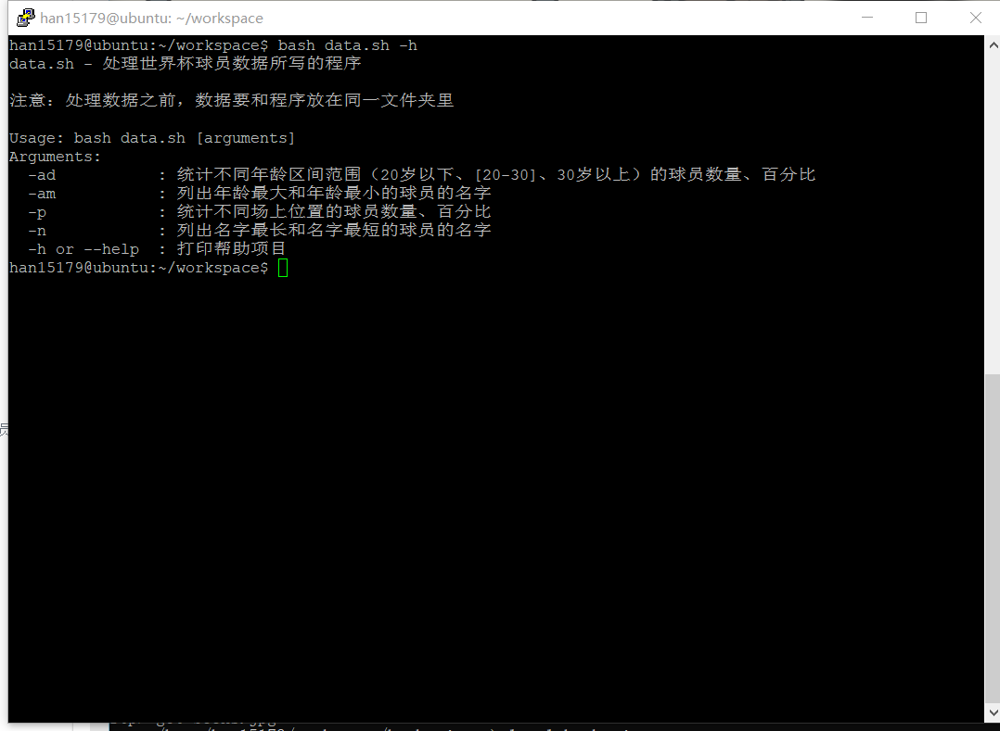

# 实验四

## 实验准备

- 虚拟机：VIrtualBox 6.1.4 r136177 (Qt5.6.2)
- Linux系统：ubuntu 18.04.4 server 64bit
  
## 实验内容

- [x] 课内练习：求2个数的最大公约数.要求：
   - 通过命令行参数读取2个整数，对不符合参数调用规范（使用小数、字符、少于2个参数等）的脚本执行要给出明确的错误提示信息，并退出代码执行

- [x] 任务一：用bash编写一个图片批处理脚本，实现以下功能： 
   - [x] 支持命令行参数方式使用不同功能
   - [x] 支持对指定目录下所有支持格式的图片文件进行批处理
   - [x] 支持以下常见图片批处理功能的单独使用或组合使用
     - [x] 支持对jpeg格式图片进行图片质量压缩
     - [x] 支持对jpeg/png/svg格式图片在保持原始宽高比的前提下压缩分辨率
     - [x] 支持对图片批量添加自定义文本水印
     - [x] 支持批量重命名（统一添加文件名前缀或后缀，不影响原始文件扩展名）
     - [x] 支持将png/svg图片统一转换为jpg格式图片

- [x] 任务二：用bash编写一个文本批处理脚本，对以下附件分别进行批量处理完成相应的数据统计任务： 
  - [2014世界杯运动员数据](data/worldcupplayerinfo.tsv)
    - [x] 统计不同年龄区间范围（20岁以下、[20-30]、30岁以上）的球员数量、百分比
    - [x] 统计不同场上位置的球员数量、百分比
    - [x] 名字最长的球员是谁？名字最短的球员是谁？
    - [x] 年龄最大的球员是谁？年龄最小的球员是谁？

- [x] 任务三：用bash编写一个文本批处理脚本，对以下附件分别进行批量处理完成相应的数据统计任务： 
  - [Web服务器访问日志](data/web_log.tsv.7z)
    - [x] 统计访问来源主机TOP 100和分别对应出现的总次数
    - [x] 统计访问来源主机TOP 100 IP和分别对应出现的总次数
    - [x] 统计最频繁被访问的URL TOP 100
    - [x] 统计不同响应状态码的出现次数和对应百分比
    - [x] 分别统计不同4XX状态码对应的TOP 10 URL和对应出现的总次数
    - [x] 给定URL输出TOP 100访问来源主机

## 实验代码及统计数据结果

- **求2个数的最大公约数**
  - [gys.sh](shell/gys.sh)
  

- **任务一**
  - [image.sh](shell/image.sh)
  - 原图片和处理后图片放在了**img**中
  
- *打开帮助文档*
  ```bash
  bash image.sh -h
  ```

  

- *对jpeg格式图片进行图片质量压缩*
  
  ```bash
  bash image.sh -d images/book.jpg -q 50%
  ```

  

    - *图片所占空间变小了*

  

- *对jpeg/png/svg格式图片在保持原始宽高比的前提下压缩分辨率*

  ```bash
  bash image.sh -d images/book.jpg -r 50
  ```

  

  
    - 图片明显变小了
  

- *对图片批量添加自定义文本水印*

  ```bash
  bash image.h -d image/book.jpg -w "www.github.com"
  ```

  

  

- *批量重命名（统一添加文件名前缀或后缀，不影响原始文件扩展名）*

  ```bash
  bash image.h -d image/book.jpg -p "P"
  bash image.h -d image/book.jpg -s "s"
  ```

  

- *将png/svg图片统一转换为jpg格式图片*

  ```bash
  bash image.h -d images/book.jpg -c
  ```

  


- **任务二**

  - [data.h](shell/data.sh)

- *打开帮助文档*

  ```bash
  bash data.sh -h
  ```

  

- *统计不同年龄区间范围（20岁以下、[20-30]、30岁以上）的球员数量、百分比*

  ```bash
  bash data.sh -ad
  ```

  

  年龄区间 | 球员数量 | 百分比
  -|-|-
  (0,20) | 9 | 1.223%
  [20,30] | 600 | 81.522%
  (30, +∞) | 127 | 17.255%

- *统计不同场上位置的球员数量、百分比*

  ```bash
  bash data.sh -p
  ```

  场上位置 | 球员数量 | 百分比
  -|-|-
  Midfielder | 268 | 36.413%
  Défenseur | 1 | 0.136%
  Defender | 236 | 32.165%
  Goalie | 96 | 13.043%
  Forward | 135 |  18.342%

  

- *名字最长的球员是谁？名字最短的球员是谁？*

  ```bash
  bash data.sh -n
  ```

  

  - 名字最长的球员：
    Francisco Javier Rodriguez
    Lazaros Christodoulopoulos
    Liassine Cadamuro-Bentaeba

  - 名字最短的球员：
    Jô

- *年龄最大的球员是谁？年龄最小的球员是谁？*

  ```bash
  bash data.sh -am
  ```

  

  - 年龄最大的球员：
    Faryd
    Mondragon

  - 年龄最小的球员：
    Fabrice
    Olinga
    Luke
    Shaw


- **任务三**

  - [weblog.sh](shell/weblog.sh)

- *打开帮助文档*

  ```bash
  bash weblog.sh -h
  ```

  

- *统计访问来源主机TOP 100和分别对应出现的总次数*

  ```bash
  bash weblog.sh -t
  ```

  - 结果：[HostTop.log](weblog/HostTop.log)

- *统计访问来源主机TOP 100 IP和分别对应出现的总次数*

  ```bash
  bash weblog.sh -i
  ```

  - 结果：[IpTop.log](weblog/TpTop.log)

- *统计最频繁被访问的URL TOP 100*

  ```bash
  bash weblog.sh -u
  ```

  - 结果：[UrlTop.log](weblog/UrlTop.log)

- *统计不同响应状态码的出现次数和对应百分比*

  ```bash
  bash weblog.sh -s
  ```

  - 结果：[States.log](weblog/States.log)

- *分别统计不同4XX状态码对应的TOP 10 URL和对应出现的总次数*

  ```bash
  bash weblog.sh -s4
  ```

  - 结果：[States4xxTop.log](weblog/States4xxTop.log)

- *给定URL输出TOP 100访问来源主机*

  ```bash
  bash weblog.sh -uh /images/NASA-logosmall.gif
  ```

  -结果：[SpecifiedURLHost.log](weblog/SpecifiedURLHost.log)

## 遇到的问题

- 输入未设定的参数脚本不会输出结果也不会结束，所以在case里加入了默认输出以防止卡死

- 添加水印时使用中文只会在图片上加上问号

## 参考

- [linux-2020-cuc-Lynn的实验报告](https://github.com/CUCCS/linux-2020-cuc-Lynn/blame/chap0x04/chap0x04)

- [linux-2020-AM00zero的实验报告](https://github.com/CUCCS/linux-2020-AM00zero/blame/chap0x04/chap0x04)

- [linux-2020-suancaiji的实验报告](https://github.com/CUCCS/linux-2020-suancaiji/tree/lab4/lab4)

- [VIM中按Ctrl+S后不能再操作](https://blog.csdn.net/s634772208/article/details/82286790)

- [vim不小心ctrl+Z解决办法](https://blog.csdn.net/lucifly/article/details/80483842)

- [ubuntu imagemagick](https://www.cnblogs.com/dylancao/p/9517168.html)

- [Linux正则匹配](https://www.cnblogs.com/think-and-do/p/7101986.html)

- [Linux find -regex详解](https://blog.csdn.net/mrwangwang/article/details/8790095?ops_request_misc=%257B%2522request%255Fid%2522%253A%2522158881422319724845030889%2522%252C%2522scm%2522%253A%252220140713.130102334.pc%255Fall.57675%2522%257D&request_id=158881422319724845030889&biz_id=0&utm_medium=distribute.pc_search_result.none-task-blog-2~all~first_rank_v2~rank_v25-1)

- [Linux sed 命令使用](https://blog.csdn.net/qq_37931597/article/details/86505723?ops_request_misc=%257B%2522request%255Fid%2522%253A%2522158881785319726869027256%2522%252C%2522scm%2522%253A%252220140713.130102334.pc%255Fall.57675%2522%257D&request_id=158881785319726869027256&biz_id=0&utm_medium=distribute.pc_search_result.none-task-blog-2~all~first_rank_v2~rank_v25-7)
  
- [Shell脚本case语句](https://www.cnblogs.com/shy13138/p/11364748.html)

- [编写Shell脚本：case、shift语句](http://blog.sina.com.cn/s/blog_67288bc90100kbkj.html)

- [shell中的(),(()),{},=,==,[],[[]]几种语法用法](https://blog.csdn.net/Michaelwubo/article/details/81698307)

- [shell数组](http://c.biancheng.net/view/810.html)

- [shell中文件后缀，目录等提取方法](https://blog.csdn.net/binggan_2019/article/details/89024460?ops_request_misc=&request_id=&biz_id=102&utm_medium=distribute.pc_search_result.none-task-blog-2~all~sobaiduweb~default-6)

- [How to Convert Images Using Linux](https://www.lifewire.com/convert-linux-command-unix-command-4097060)

- [Linux awk 命令](https://www.runoob.com/linux/linux-comm-awk.html)

- [awk编程基础](hhttps://www.cnblogs.com/meitian/p/5302416.html)

- [awk命令详解及示例](https://blog.csdn.net/jsut_rick/article/details/78287744?utm_medium=distribute.pc_relevant.none-task-blog-BlogCommendFromBaidu-1&depth_1-utm_source=distribute.pc_relevant.none-task-blog-BlogCommendFromBaidu-1)

- [awk中二维数组使用](https://blog.csdn.net/beyondlpf/article/details/7024730)


