# 实验五：web服务器实验

## 1.实验环境

- 虚拟机：VIrtualBox 6.1.4 r136177 (Qt5.6.2)
- Linux系统：ubuntu 18.04.4 server 64bit
  
## 2.实验过程

### 基本要求

#### 【Nginx/MySQL/PHP】
<details>

- 安装Nginx
    ```
    sudo apt update
    sudo apt install nginx
    ```
  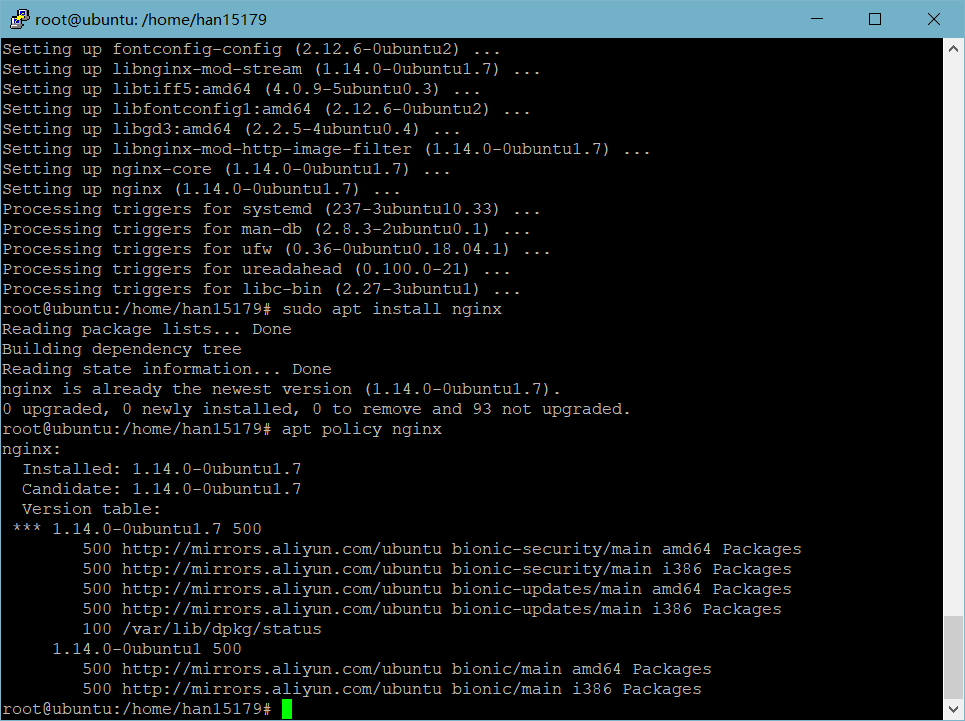

- 安装MySQL
    ```
    sudo apt install mysql-server
    ```
  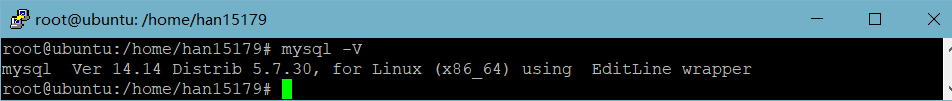

- 安装PHP
    ```
    sudo apt install php-fpm php-mysql
    ```
  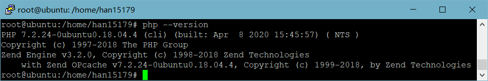

- 访问服务器
  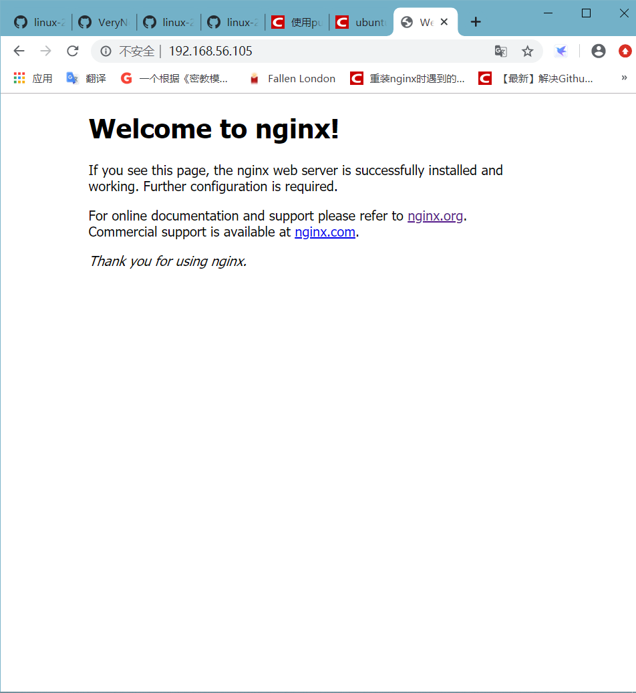

</details>

#### 【VeryNginx】

<details>

- 安装VeryNginx
    ```
    git clone https://github.com/alexazhou/VeryNginx.git
    cd VeryNginx
    
    sudo apt-get install libpcre3-dev libssl1.0-dev zlib1g-dev build-essential

    sudo python install.py install
    ```
  
  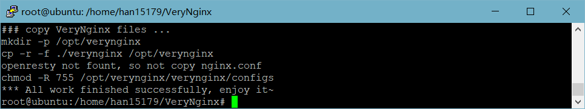

- 修改/opt/verynginx/openresty/nginx/conf/nginx.conf配置文件
    ```
    vim /opt/verynginx/openresty/nginx/conf/nginx.conf
    ```

- 访问：
    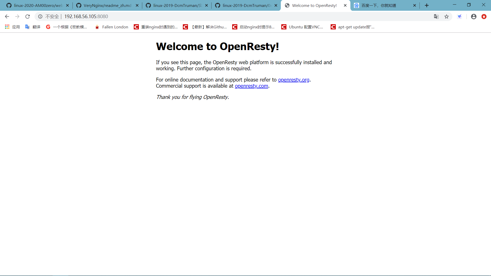

- 在主机访问VeryNginx配置界面，从`http://vn.sec.cuc.edu.cn//verynginx/index.html`登录
  
    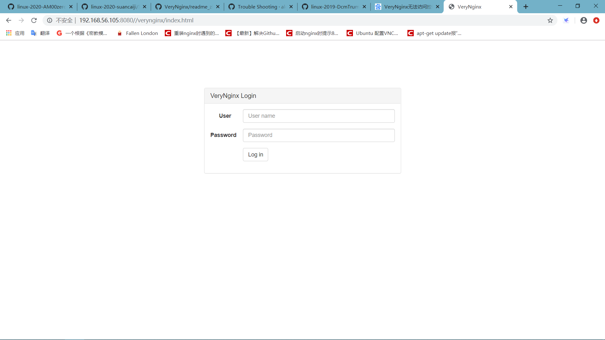 
    
    输入默认账号密码登陆成功，进入配置界面:
    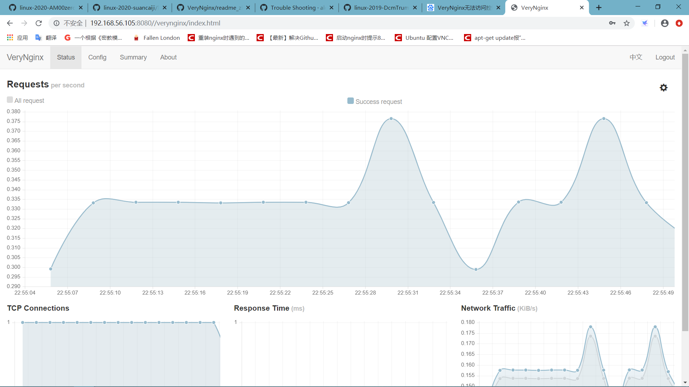

</details>

#### 【WordPress】

<details>

- 创建数据库和供WordPress使用的用户
    ```
    sudo mysql
    
    mysql> CREATE DATABASE wordpress DEFAULT CHARACTER SET utf8 COLLATE utf8_unicode_ci;
    
    mysql> GRANT ALL ON wordpress.* TO 'wordpressuser'@'localhost' IDENTIFIED BY 'password';
    
    mysql> FLUSH PRIVILEGES;
    
    mysql> exit;
    ```

- 安装其他PHP扩展 
    ```
    sudo apt update

    sudo apt install php-curl php-gd php-intl php-mbstring php-soap php-xml php-xmlrpc php-zip
    
    sudo systemctl restart php7.2-fpm
    ```

- 配置Nginx服务器块文件 
 
  - 创建新服务器块配置文件
    ```
    sudo vim /etc/nginx/sites-available/wp.sec.cuc.edu.cn
    ```

    写入：
    ```
    server {
        listen 80 default_server;
        listen [::]:80 default_server;

        root /var/www/html/wp.sec.cuc.edu.cn;
        index index.php index.html index.htm index.nginx-debian.html;
        server_name wp.sec.cuc.edu.cn;

        location / {
            try_files $uri $uri/ /index.php$is_args$args;
    
        }
           
        location ~ \.php$ {
            include snippets/fastcgi-php.conf;
            fastcgi_pass unix:/var/run/php/php7.2-fpm.sock;
        }

        location ~ /\.ht {
            deny all;
        }
    }
    ```
    
  - 创建新链接来启用新服务器块
    ```
    sudo ln -s /etc/nginx/sites-available/wp.sec.cuc.edu.cn /etc/nginx/sites-enabled/
    ```

  - 取消链接默认配置文件
    ```
    sudo unlink /etc/nginx/sites-enabled/default
    ```
  - 测试新配置文件的语法错误并重启服务
    ```
    sudo nginx -t
    sudo systemctl reload nginx
    ```

- 下载WordPress
    ```
    cd /tmp
    sudo wget https://wordpress.org/wordpress-4.7.zip
    
    unzip wordpress-4.7.zip

    cp /tmp/wordpress/wp-config-sample.php /tmp/wordpress/wp-config.php
    
    sudo mkdir /var/www/html/wp.sec.cuc.edu.cn

    sudo cp -ar /tmp/wordpress/. /var/www/html/wp.sec.cuc.edu.cn
    
    sudo chown -R www-data:www-data /var/www/html/wp.sec.cuc.edu.cn
    ```

- 设置WordPress配置文件
    ```
    
    curl -s https://api.wordpress.org/secret-key/1.1/salt/
    
    sudo vim /var/www/wordpress/wp-config.php
    ```

- 配置VeryNginx访问`wp.sec.cuc.edu.cn`
  - 添加Request Matcher
    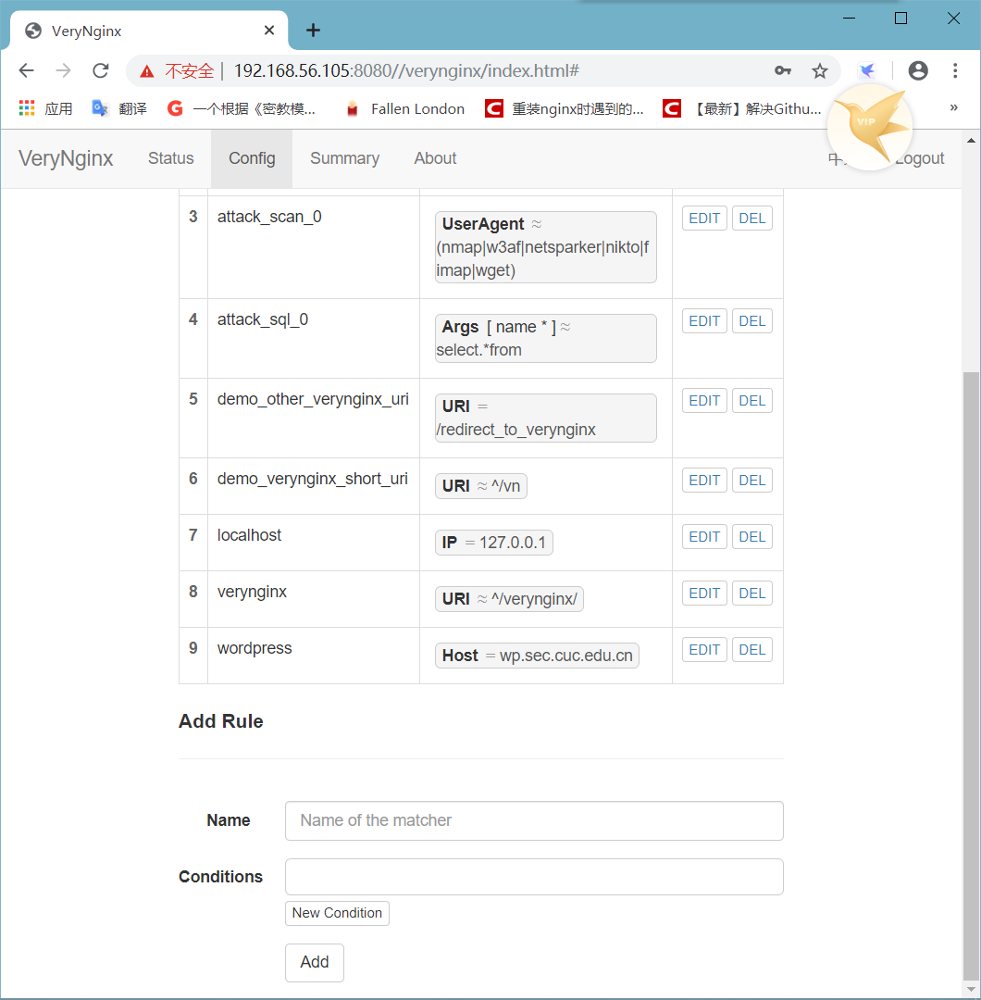
  - 添加Up Stream节点和代理通行证
    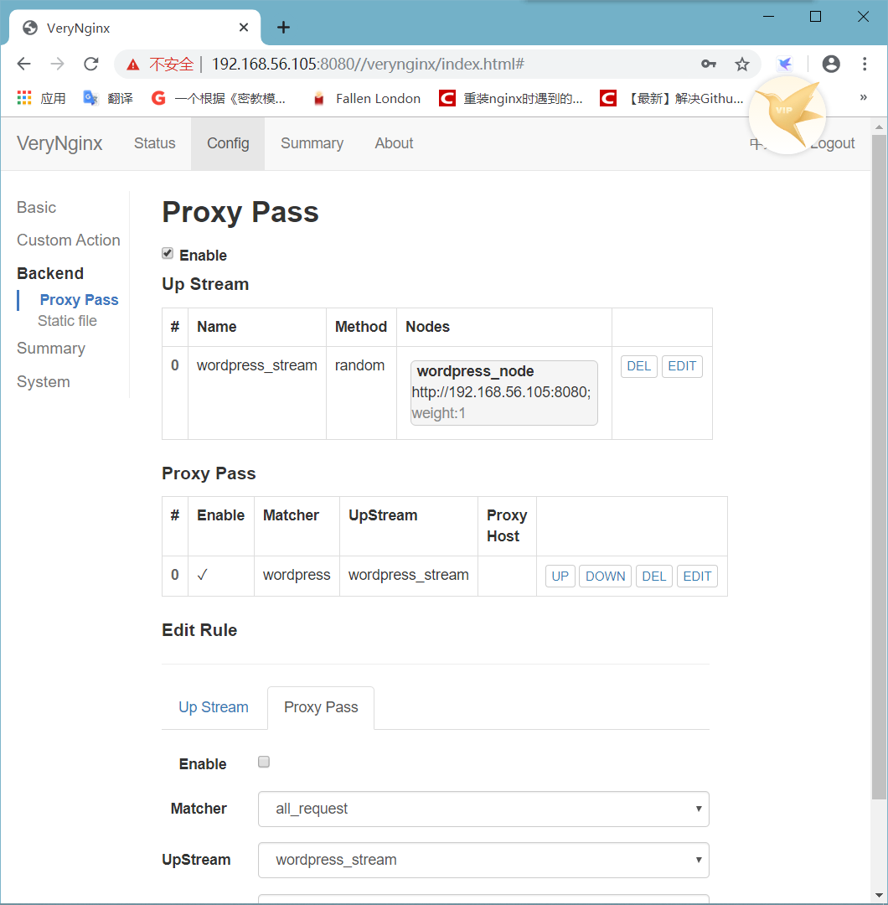

  访问`wp.sec.cuc.edu.cn`,进入安装界面
    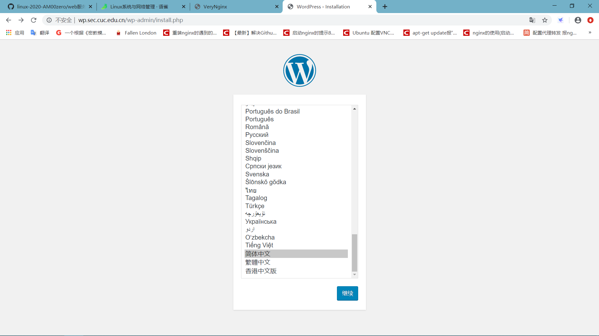
    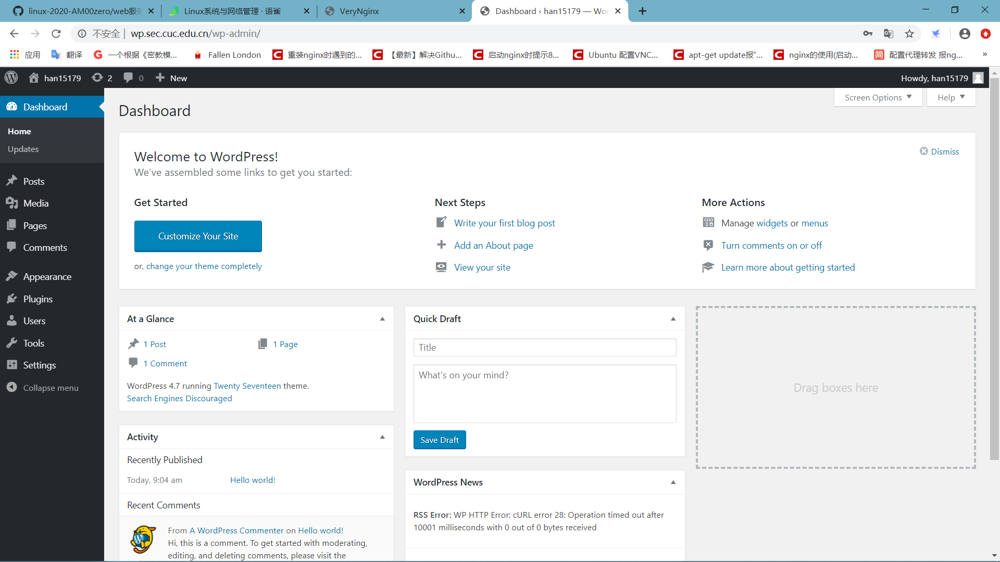
    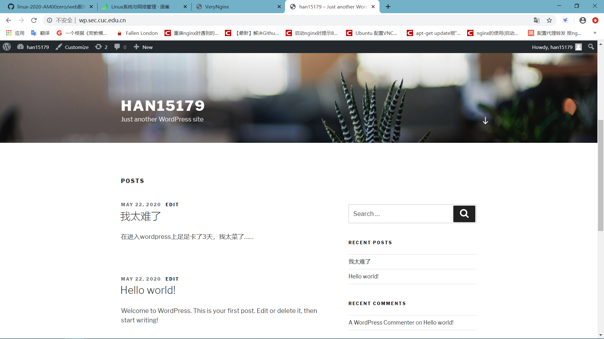

</details>

#### 【DVWA】

<details>

- 下载安装
    ```
    sudo git clone https://github.com/ethicalhack3r/DVWA /tmp/DVWA
    
    sudo mkdir /var/www/html/dvwa.sec.cuc.edu.cn

    sudo cp -r /tmp/DVWA/. /var/www/html/dvwa.sec.cuc.edu.cn
    ```

- 创建数据库和供DVWA使用的用户
    ```
    sudo mysql
    
    mysql> CREATE DATABASE dvwa DEFAULT CHARACTER SET utf8 COLLATE utf8_unicode_ci;
    
    mysql> GRANT ALL ON  dvwa.* TO 'dvwauser'@'localhost' IDENTIFIED BY 'p@ssw0rd';
    
    mysql> FLUSH PRIVILEGES;
    
    mysql> exit;
    ```
- 设置DVWA与PHP等相关环境
    ```
    sudo cp /var/www/html/dvwa.sec.cuc.edu.cn/config/config.inc.php.dist /var/www/html/dvwa.sec.cuc.edu.cn/config/config.inc.php

    sudo vim /var/www/html/DVWA/config/config.inc.php
    
    sudo vim /etc/php/7.2/fpm/php.ini
    
    sudo systemctl restart php7.2-fpm
    
    sudo chown -R www-data.www-data /var/www/html/dvwa.sec.cuc.edu.cn
    ```
 
- 创建新服务器块配置文件
    ```
    sudo vim /etc/nginx/sites-available/dvwa.sec.cuc.edu.cn
    ```
    从中写入如下类似：
    ```
    server {
        listen 8008 default_server;
        listen [::]:8008 default_server;

        root /var/www/html/dvwa.sec.cuc.edu.cn;
        index index.php index.html index.htm index.nginx-debian.html;
        server_name dvwa.sec.cuc.edu.cn;

        location / {
            try_files $uri $uri/ /index.php$is_args$args;  
        }
  
        location ~ \.php$ {
            include snippets/fastcgi-php.conf;
            fastcgi_pass unix:/var/run/php/php7.2-fpm.sock;
        }

        location ~ /\.ht {
            deny all
        }
    }
    ```
    
- 创建链接
    ```
    sudo ln -s /etc/nginx/sites-available/wp.sec.cuc.edu.cn /etc/nginx/sites-enabled/
    ```

- 测试新配置文件的语法错误并重启服务
    ```
    sudo nginx -t
    sudo systemctl reload nginx
    ```

- 配置VeryNginx
  - 添加Request Matcher
  - 添加Up Stream节点
  - 添加代理通行证

- 访问`dvwa.sec.cuc.edu.cn`
    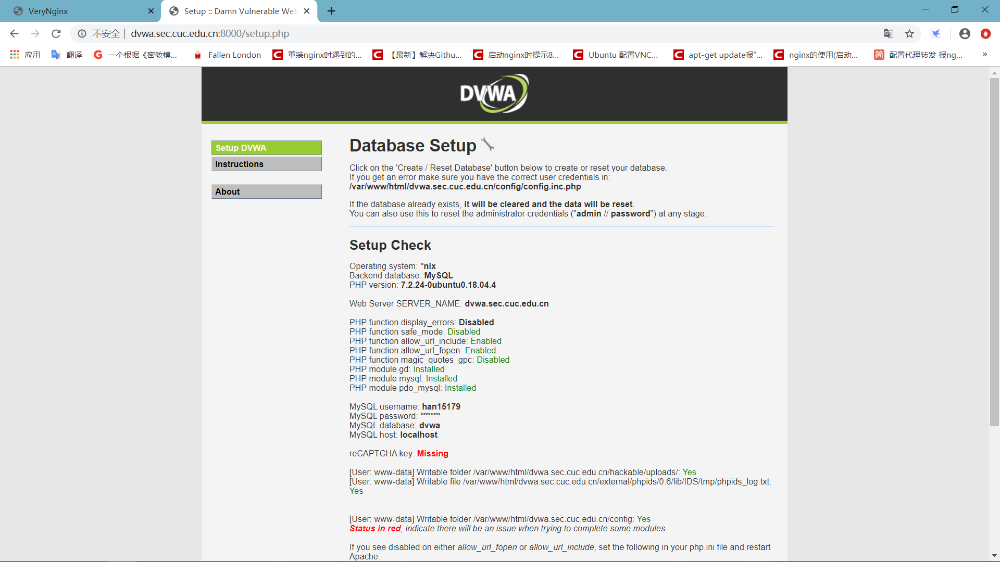
    
    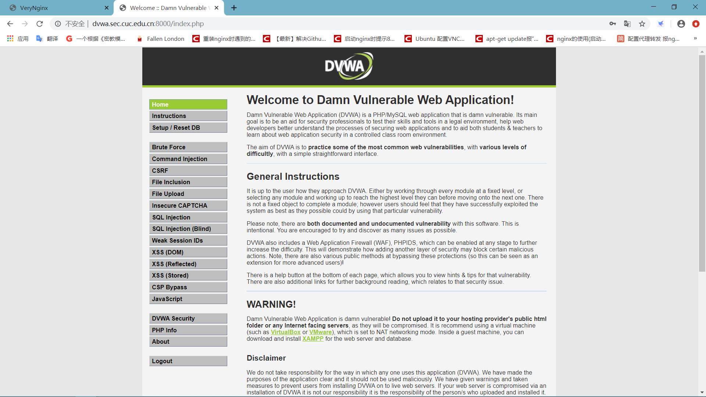

</details>

### 安全加固要求

##### 1.使用IP地址方式均无法访问上述任意站点

<details>

- 匹配所有ip地址
  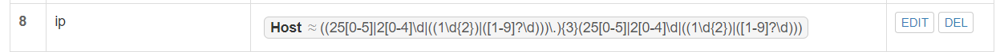
- 设置相应匹配器的Response
  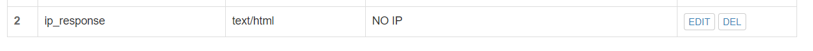
- 设置Filter，返回403
  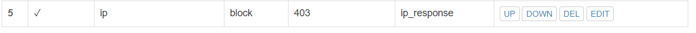
- 此时无法ip形式访问，并返回403:
  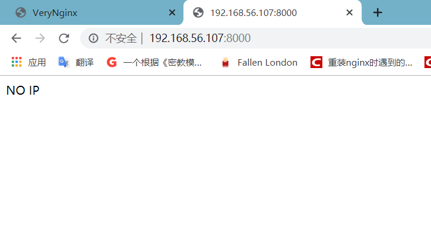

</details>

##### 2.DVWA只允许白名单上的访客来源IP

<details>

- 匹配白名单内特定ip
  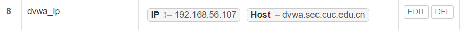
- 设置对于不在白名单范围内ip的Response
  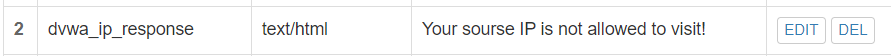
- 设置Filter，返回403Code
  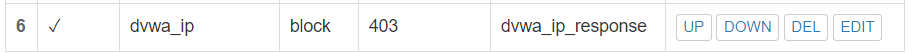
- 此时白名单外访客来源ip无法访问，返回403:
  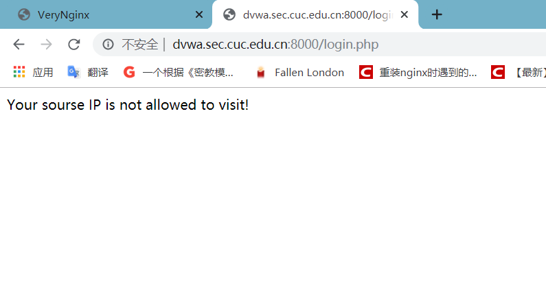

</details>

##### 3.在不升级Wordpress版本的情况下，通过定制VeryNginx的访问控制策略规则，热修复WordPress < 4.7.1 - Username Enumeration

<details>

- 匹配
  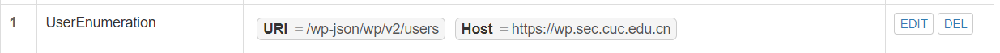
- 设置Filter
  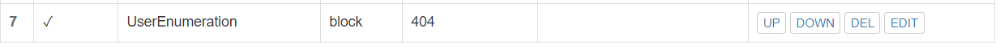
- 返回404
  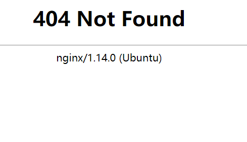

</details>

##### 4.通过配置VeryNginx的Filter规则实现对Damn Vulnerable Web Application(DVWA)的SQL注入实验在低安全等级条件下进行防护

<details>

- 匹配规则
  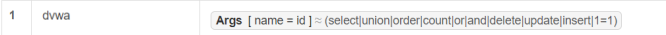
- 设置Filter，返回404
  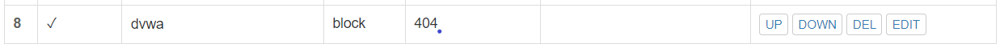
- 测试：
  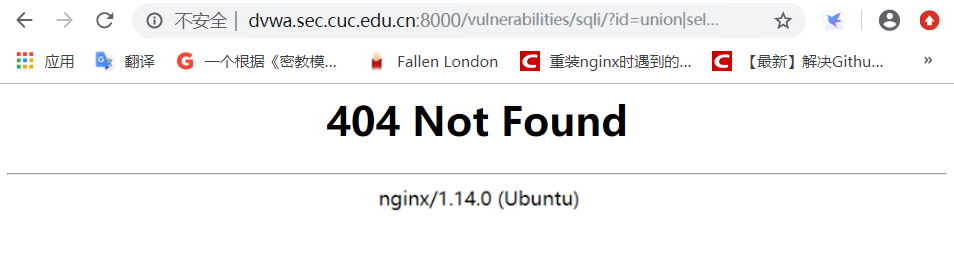

</details>

##### 5.VeryNginx的Web管理页面仅允许白名单上的访客来源IP

<details>

- 匹配特定ip
  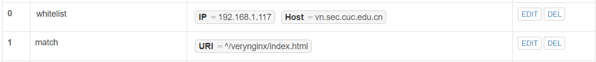
  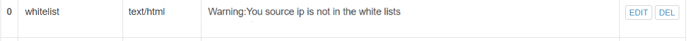
- 设置Filter
  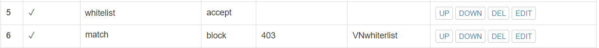
- 此时白名单外访客来源ip无法访问
  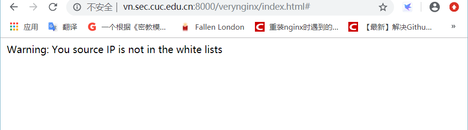

</details>

## 3.参考

<details>

- [linux-2020-AM00zero/chap0x05/web服务器实验报告.md](https://github.com/CUCCS/linux-2020-AM00zero/blob/chap0x05/chap0x05/web%E6%9C%8D%E5%8A%A1%E5%99%A8%E5%AE%9E%E9%AA%8C%E6%8A%A5%E5%91%8A.md)
- [linux-2019-DcmTruman/0x05/实验报告.md](https://github.com/CUCCS/linux-2019-DcmTruman/blob/0x05/0x05/%E5%AE%9E%E9%AA%8C%E6%8A%A5%E5%91%8A.md)
- [linux-2020-suancaiji/lab5/第五章实验报告.md](https://github.com/CUCCS/linux-2020-suancaiji/blob/lab5/lab5/%E7%AC%AC%E4%BA%94%E7%AB%A0%E5%AE%9E%E9%AA%8C%E6%8A%A5%E5%91%8A.md)
- [VeryNginx中文文档](https://github.com/alexazhou/VeryNginx/blob/master/readme_zh.md)
- [VeryNginx Trouble Shooting](https://github.com/alexazhou/VeryNginx/wiki/Trouble-Shooting)
- [重装nginx时遇到的问题](https://blog.csdn.net/aabbcc456aa/article/details/82053743)
- [解决Github网页上图片显示失败的问题](https://blog.csdn.net/qq_38232598/article/details/91346392)
- [启动nginx时提示80端口被自身占用](https://blog.csdn.net/guo_wenjing/article/details/79208936)
- [nginx的使用](https://blog.csdn.net/daipianpian/article/details/83034777)
- [配置代理转发 报nginx: [emerg] unexpected "}" in /etc/nginx/nginx.conf的解决办法](https://www.jianshu.com/p/193c9b929ad8)
- [检测nginx配置是否正确的方法](https://www.jianshu.com/p/26d562bf69bb)


</details>

## 4.问题

<details>

  - 试验过程中遇到了大量问题，多次重装系统，IP号从101一直变到了107……所以前后截图会有所不同

</details> 