# 实验六

## 1.实验环境

- 工作主机A
  - 虚拟机：VirtualBox 6.1.4
  - Linux系统：Ubuntu 18.04.4 server 64-bit
  - 配置nat和host-only网卡(192.168.56.105)
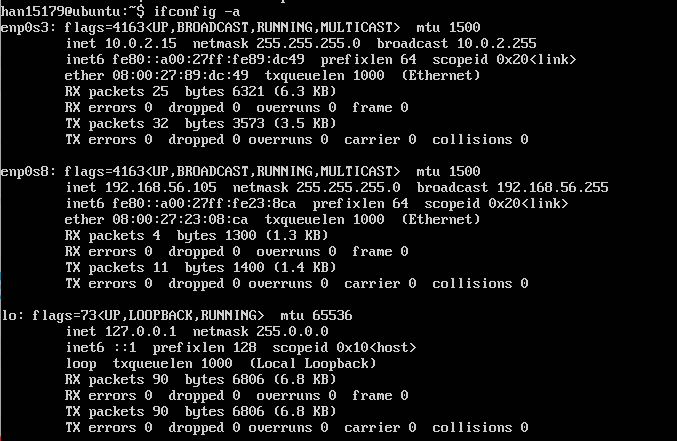

  
- 目标主机B
  - 虚拟机：VirtualBox 6.1.4
  - Linux系统：Ubuntu-18.04.4 LTS desktop 64-bit
  - 配置nat和host-only网卡(192.168.56.108) 
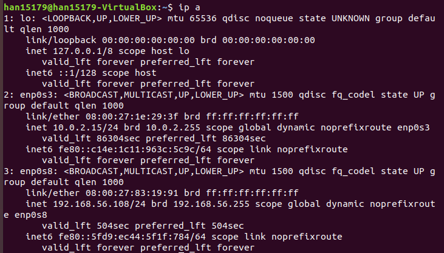
  
## 2.实验过程

#### ssh免密登录

- 在工作主机A上生成密钥对
  ```bash
  ssh-keygen 
  ```
- 在目标主机B上安装openssh-server
  ```bash
  sudo apt install openssh-server
- 修改目标主机B中sshd配置文件

  ```bash
  sudo vim /etc/ssh/sshd_config
  ```
  
  ```bash
  PermitRootLogin yes
  ```

  ```bash
  sudo systemctl restart ssh
  ```

- 为后续传输公钥给root，设置root用户密码
  
  ```bash
  sudo passwd root
  ```

- 将公钥传输到目标主机
  ```bash
  ssh-copy-id -i key.pub root@192.168.56.108
  ```

- 免密登陆
    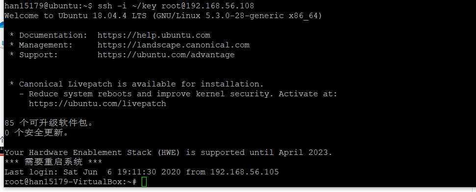

#### FTP：vsftpd

- 配置一个提供匿名访问的FTP服务器，匿名访问者可以访问1个目录且仅拥有该目录及其所有子目录的只读访问权限；
  - 匿名访问
      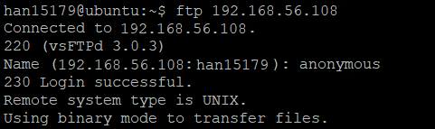
  - 匿名用户操作
      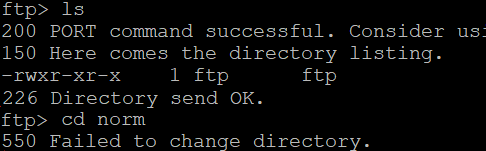

- 配置一个支持用户名和密码方式访问的账号，该账号继承匿名访问者所有权限，且拥有对另1个独立目录及其子目录完整读写（包括创建目录、修改文件、删除文件等）权限；

  - 访问目标主机
      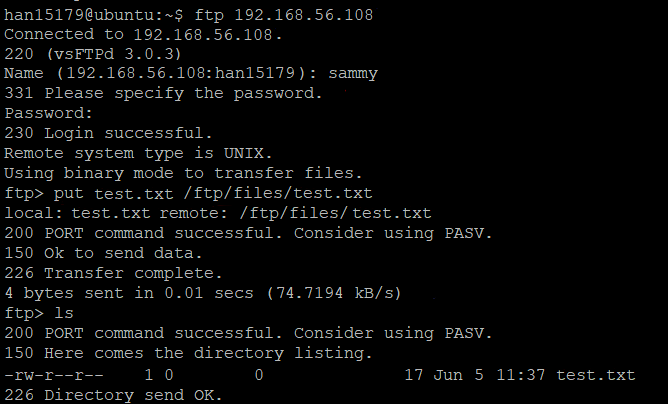

- 该账号仅可用于FTP服务访问，不能用于系统shell登录；
    - 在目标主机使用系统shell登录失败
        

- FTP用户不能越权访问指定目录之外的任意其他目录和文件；
  - 不能越权访问
      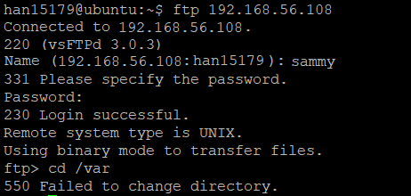

- 匿名访问权限仅限白名单IP来源用户访问，禁止白名单IP以外的访问；
  - 名单外IP不能访问
    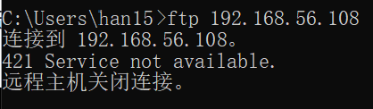

- 配置文件：
  - [vsftpd.conf](conf/vsftpd.conf)
  - [hosts.allow](conf/hosts.allow)
  - [hosts.deny](hosts.deny)

#### NFS

- 在1台Linux上配置NFS服务，另1台电脑上配置NFS客户端挂载2个权限不同的共享目录，分别对应只读访问和读写访问权限；
  - 共享目录
      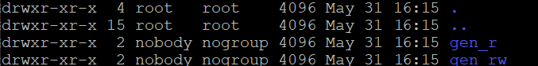
  - 只读
      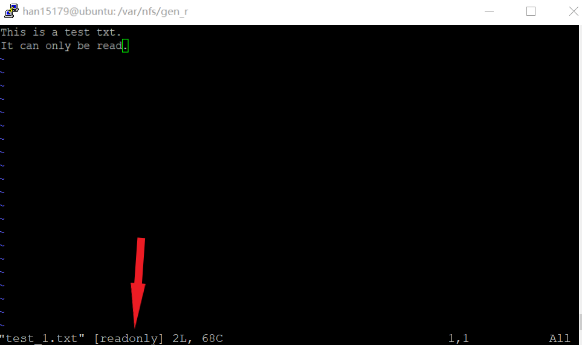
  - 读写
      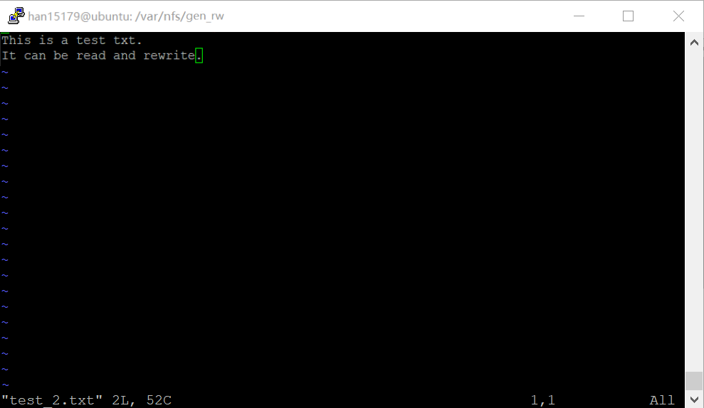

- 配置文件：
  - [exports](conf/exports)

#### samba

- Linux访问Windows的匿名共享目录
    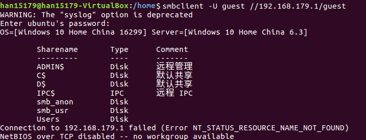

- Linux访问Windows的用户名密码方式共享目录
    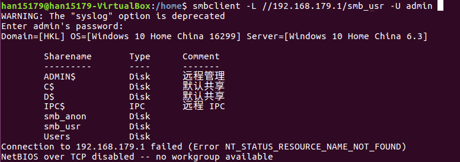

- 配置文件：
  - [smb.conf](conf/smb.conf)

#### DHCP

- 2台虚拟机使用Internal网络模式连接，其中一台虚拟机上配置DHCP服务，另一台服务器作为DHCP客户端，从该DHCP服务器获取网络地址配置
  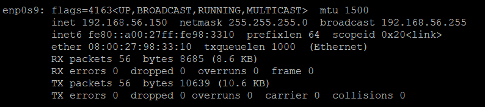

- 配置文件：
  - [dhcpd.conf](conf/dhcpd.conf)

#### DNS

- 基于上述Internal网络模式连接的虚拟机实验环境，在DHCP服务器上配置DNS服务，使得另一台作为DNS客户端的主机可以通过该DNS服务器进行DNS查询
  ```bash
  dig wp.sec.cuc.edu.cn
  dig svwa.sec.cuc.edu.cn
  ```

  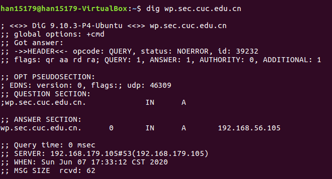
  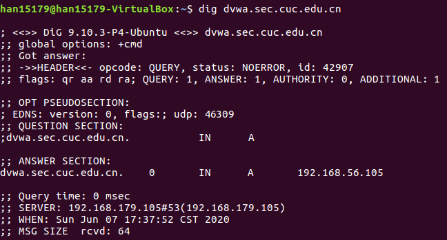

- 配置文件：
  - [named.conf.local](conf/named.conf.local)
  - [named.conf.options](conf/named.conf.options)
  - [db.cuc.edu.cn](conf/db.cuc.edu.cn)
  - [interfaces](conf/interfaces)


## 3.参考

[linux-2020-AM00zero的实验报告](https://github.com/CUCCS/linux-2020-AM00zero/blame/chap0x06/chap0x06/shell%E8%84%9A%E6%9C%AC%E7%BC%96%E7%A8%8B%E8%BF%9B%E9%98%B6%E5%AE%9E%E9%AA%8C%EF%BC%88%E7%BD%91%E7%BB%9C%EF%BC%89.md)

[linux-2020-NewDividedc的实验报告](https://github.com/CUCCS/linux-2020-NewDividedc/blob/chap0x06/chap0x06/chap0x06.md)

## 4.后记
- 我实现不了自动配置……
